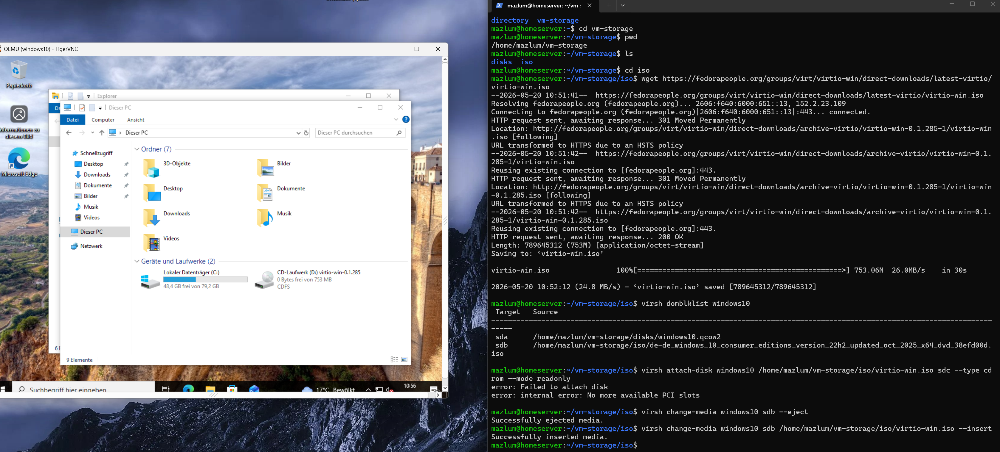
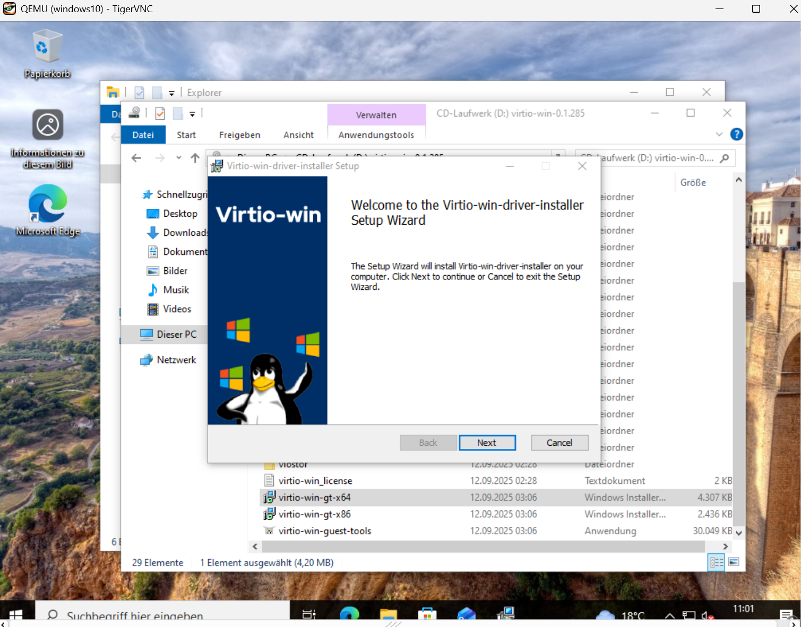
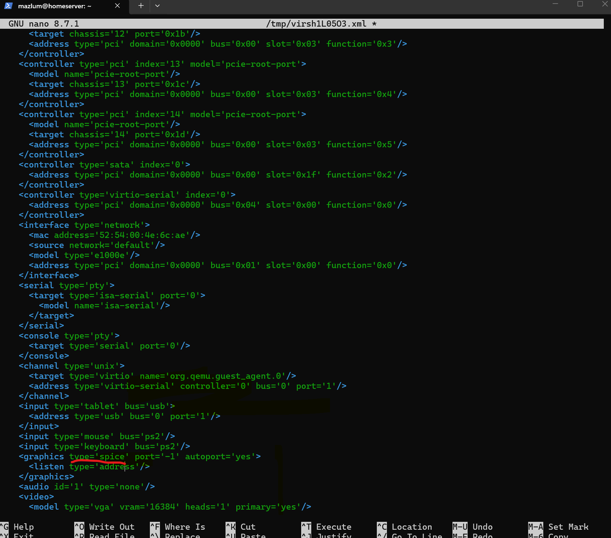

# Phase 5 — VirtIO Integration & QEMU Guest Agent

## Goal

After the initial Windows VM deployment and remote access setup, the next step was optimizing the virtual machine integration between the Ubuntu KVM host and the Windows 10 guest system.

This phase focused on:

- Installing VirtIO drivers and guest tools
- Enabling QEMU Guest Agent communication
- Creating additional VM recovery snapshots
- Improving virtualization integration
- Understanding VM hardware configuration in libvirt/KVM

---

# Why VirtIO?

By default, Windows uses generic emulated hardware inside a virtual machine.

While functional, this causes:
- worse performance
- slower virtual devices
- less efficient communication
- higher CPU overhead
- laggy interaction

VirtIO provides optimized paravirtualized drivers specifically designed for KVM/QEMU virtualization.

Benefits include:
- improved VM performance
- better disk/network handling
- improved integration
- cleaner host ↔ guest communication
- enhanced virtualization features

---

# Downloading VirtIO Drivers

The VirtIO ISO was downloaded directly on the Ubuntu KVM host.

```bash
cd ~/vm-storage/iso
```

### Explanation

| Command | Meaning |
|---|---|
| `cd` | change directory |
| `~/vm-storage/iso` | ISO storage location |

---

```bash
wget https://fedorapeople.org/groups/virt/virtio-win/direct-downloads/latest-virtio/virtio-win.iso
```

### Explanation

| Command | Meaning |
|---|---|
| `wget` | download file from URL |
| `virtio-win.iso` | VirtIO driver ISO |

---

# Verifying Attached VM Media

Before attaching the VirtIO ISO, existing VM block devices were inspected.

```bash
virsh domblklist windows10
```

### Explanation

| Command | Meaning |
|---|---|
| `virsh` | libvirt/KVM management tool |
| `domblklist` | list VM block devices |
| `windows10` | VM name |

---

## Attached VM Storage Overview



---

# Replacing the Existing ISO

Initially, attaching another virtual CD-ROM failed because all available PCI slots were already occupied.

The solution was ejecting the current Windows installation ISO and inserting the VirtIO ISO into the existing virtual CD-ROM device.

---

## Eject Existing ISO

```bash
virsh change-media windows10 sdb --eject
```

### Explanation

| Command | Meaning |
|---|---|
| `change-media` | modify virtual CD media |
| `sdb` | existing virtual CD-ROM device |
| `--eject` | remove inserted ISO |

---

## Insert VirtIO ISO

```bash
virsh change-media windows10 sdb /home/mazlum/vm-storage/iso/virtio-win.iso --insert
```

### Explanation

| Command | Meaning |
|---|---|
| `change-media` | replace virtual media |
| `sdb` | VM CD-ROM device |
| `virtio-win.iso` | VirtIO driver ISO |
| `--insert` | insert new media |

---

# VirtIO Driver ISO Mounted in Windows

Inside the Windows VM, the VirtIO ISO appeared as a mounted CD drive.


---

# Installing VirtIO Guest Tools

The VirtIO installer was launched inside the Windows VM.

Installed components included:
- VirtIO drivers
- QEMU guest tools
- virtualization integration services

---

## VirtIO Installer



---

# Installing the QEMU Guest Agent

The QEMU Guest Agent enables communication between:
- the Ubuntu KVM host
- and the Windows guest operating system.

This provides:
- VM status communication
- clean shutdown support
- snapshot coordination
- advanced virtualization management

---

# Initial Guest Agent Check

The first communication attempt failed because the VM configuration did not yet contain a guest-agent communication channel.

```bash
virsh qemu-agent-command windows10 '{"execute":"guest-ping"}'
```

Result:

```text
error: argument unsupported: QEMU guest agent is not configured
```

---

# Understanding the Problem

Although:
- the Guest Agent service was installed inside Windows
- and running successfully

the Linux host still could not communicate with it because:
# the VM hardware configuration lacked a VirtIO communication channel.

This required manually editing the VM XML configuration.

---

# Editing the VM Configuration

```bash
virsh edit windows10
```

### Explanation

| Command | Meaning |
|---|---|
| `virsh` | KVM/libvirt management |
| `edit` | edit VM XML configuration |
| `windows10` | VM name |

---

# Adding the Guest Agent Communication Channel

Inside the `<devices>` section, the following XML configuration was added:

```xml
<channel type='unix'>
  <target type='virtio' name='org.qemu.guest_agent.0'/>
</channel>
```

This creates a virtual communication channel between:
- the Linux host
- and the Windows guest system.

---

## VM XML Configuration



---

# Restarting the VM

After editing the VM configuration, the virtual machine was restarted.

```bash
virsh start windows10
```

---

# Successful Guest Agent Communication

After rebooting, the Linux host successfully communicated with the Windows Guest Agent.

```bash
virsh qemu-agent-command windows10 '{"execute":"guest-ping"}'
```

Result:

```json
{"return":{}}
```

This confirmed:
- working host ↔ guest communication
- functioning QEMU Guest Agent integration
- successful VirtIO channel configuration

---

## Successful Guest Agent Test


---

# VM Snapshot Creation

After completing the VirtIO and Guest Agent integration successfully, a new VM snapshot was created.

Snapshots act as recovery checkpoints and allow restoring the VM to a known-good state.

---

## Creating a Snapshot

```bash
virsh snapshot-create-as windows10 virtio-and-qemu-agent-working
```

### Explanation

| Command | Meaning |
|---|---|
| `snapshot-create-as` | create VM snapshot |
| `windows10` | VM name |
| `virtio-and-qemu-agent-working` | snapshot name |

---

## Snapshot Created Successfully


---

# Current VM Optimization Status

## Successfully Integrated

- VirtIO Guest Tools
- QEMU Guest Agent
- Windows Updates
- Snapshot Management
- Host ↔ Guest Communication
- Improved VM Integration

---

# Infrastructure Status After Phase 5

## Remote Access
- Cloudflare Tunnel
- Native SSH Access
- Remote VNC Access

## Virtualization
- KVM/QEMU
- libvirt
- snapshots
- VirtIO integration
- QEMU Guest Agent

---

# Lessons Learned

This phase provided practical experience with:
- KVM virtualization internals
- VM XML hardware configuration
- VirtIO integration
- QEMU Guest Agent communication
- VM snapshots
- Linux VM administration
- host ↔ guest communication architecture

The system now provides a stable and optimized virtualization foundation for the upcoming Silkroad Online server environment.
