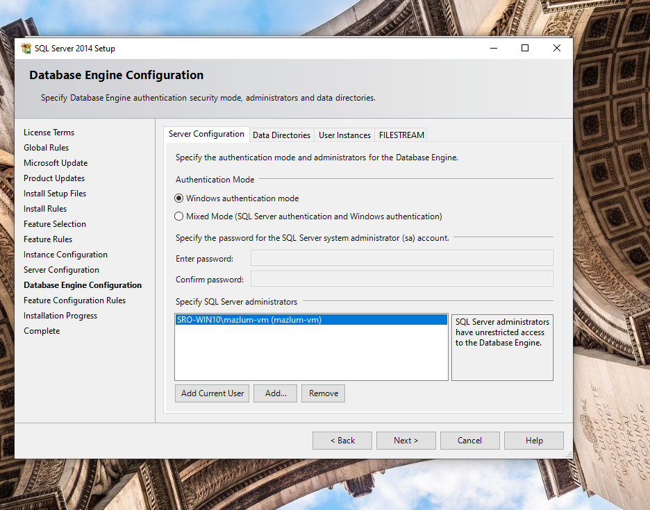
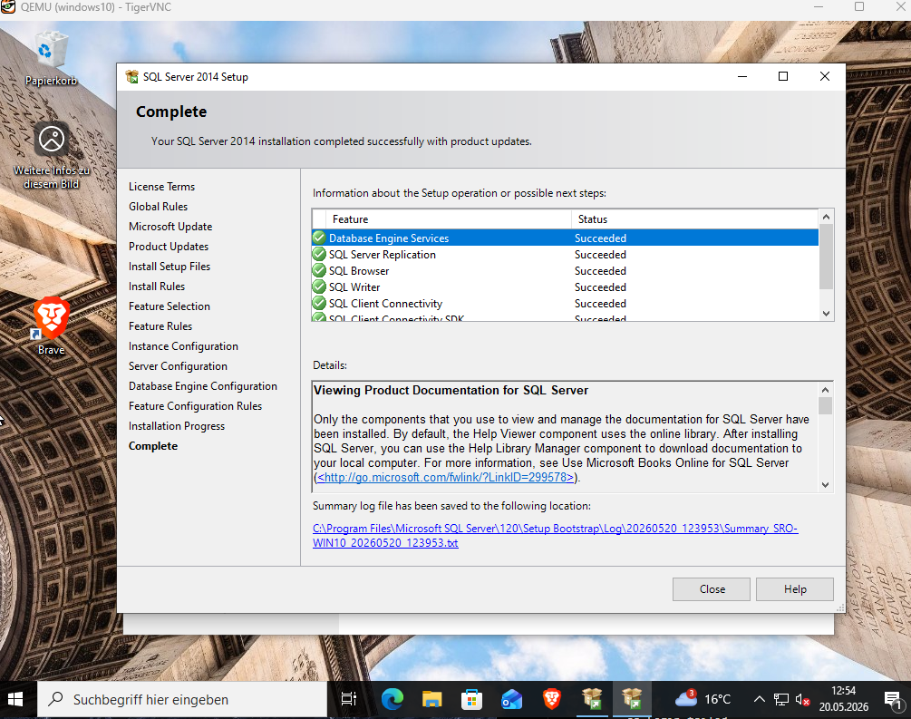

# Phase 6 — Microsoft SQL Server 2014 Installation

## Goal

After completing the virtualization and VirtIO integration phase, the next step was preparing the backend infrastructure required for a Silkroad Online server environment.

This phase focused on:
- Installing Microsoft SQL Server 2014 Express
- Understanding SQL Server architecture
- Configuring authentication modes
- Preparing a stable database environment for vSRO files
- Creating a recovery snapshot after successful installation

---

# Why SQL Server?

Silkroad Online server files rely heavily on Microsoft SQL Server.

The database backend stores:
- accounts
- characters
- items
- guilds
- skills
- server configurations
- logs
- game world data

Without SQL Server:
- the login server cannot function
- character data cannot be stored
- the game world cannot load properly

---

# Why SQL Server 2014 Express?

SQL Server 2014 Express was selected because it provides the best compatibility with most publicly available vSRO server files.

Advantages include:
- excellent compatibility with vSRO 188 based files
- stable Windows 10 support
- large amount of community documentation
- low resource usage
- fewer compatibility issues with older Silkroad tools

---

# Downloading SQL Server 2014

The official Microsoft SQL Server 2014 Express x64 installer was downloaded.

Selected package:

```text
SQLEXPR_x64_ENU.exe
```

### Explanation

| Part | Meaning |
|---|---|
| SQL | Microsoft SQL Server |
| EXPR | Express Edition |
| x64 | 64-bit |
| ENU | English version |

The English version was intentionally selected to improve familiarity with international IT terminology and documentation standards.

---

# Starting the Installation

Inside the SQL Server Installation Center, a new standalone SQL installation was selected.

## SQL Server Installation Wizard


The following option was selected:

```text
New SQL Server stand-alone installation or add features to an existing installation
```

### Explanation

This installs a completely new SQL Server instance rather than upgrading an existing installation.

---

# Feature Selection

The default SQL Express features were kept enabled.

Installed components included:
- Database Engine Services
- SQL Server Replication
- SQL Client Connectivity SDK

These components provide:
- the actual database engine
- database communication libraries
- SQL connectivity support

---

# SQL Instance Configuration

The default SQL Express instance name was kept:

```text
SQLEXPRESS
```

### Why this matters

SQL Server supports multiple isolated database instances on a single system.

The selected default instance:
```text
SQLEXPRESS
```

is widely used in:
- vSRO tutorials
- older Silkroad tools
- SQL connection configurations

This improves compatibility and reduces configuration complexity later.

---

# SQL Server Services

The SQL Database Engine service was configured to start automatically with Windows.

### Why this matters

This ensures:
- SQL Server starts automatically after reboot
- SRO services can access databases immediately
- no manual SQL startup is required

The SQL Server Browser service remained disabled because the environment currently only requires a local SQL instance.

---

# Database Engine Authentication

One of the most important configuration steps was enabling:

```text
Mixed Mode Authentication
```

## SQL Authentication Configuration



### Why Mixed Mode?

Silkroad server environments typically rely on:
- SQL logins
- legacy SQL authentication
- the built-in `sa` administrator account

instead of Windows-only authentication.

Without Mixed Mode:
- many older SRO tools fail
- SQL logins cannot be used
- database imports may break

---

# Configuring the `sa` Administrator Account

A custom password was configured for the built-in SQL administrator account:

```text
sa
```

The `sa` account acts as:
# the highest privileged SQL administrator account

similar to:
```text
root
```
on Linux systems.

This account will later be required for:
- database imports
- SQL Management Studio
- SRO database tools
- server configuration
- database maintenance

---

# Completing the SQL Installation

After all checks completed successfully, SQL Server 2014 Express was installed successfully.

## SQL Installation Finished Successfully



---

# Creating a VM Snapshot

After verifying the SQL installation, a new VM snapshot was created from the Ubuntu KVM host.

This snapshot acts as a recovery point before importing Silkroad server files and databases.

---

## Creating the Snapshot

```bash
virsh snapshot-create-as windows10 sql-server-installed
```

### Explanation

| Command | Meaning |
|---|---|
| `snapshot-create-as` | create VM snapshot |
| `windows10` | VM name |
| `sql-server-installed` | snapshot name |

---

## Snapshot Successfully Created


---

# Current Infrastructure Status

## Virtualization
- KVM/QEMU
- libvirt
- VirtIO integration
- QEMU Guest Agent
- VM snapshot management

## Remote Access
- Cloudflare Tunnel
- Native SSH access
- Remote VNC access

## Windows VM
- Windows 10 fully updated
- VirtIO drivers installed
- SQL Server 2014 Express installed

---

# Lessons Learned

This phase provided practical experience with:
- SQL Server architecture
- SQL authentication modes
- SQL instances
- Windows services
- backend infrastructure preparation
- database server deployment
- virtualization recovery planning

The environment is now fully prepared for:
- Silkroad Online database imports
- vSRO server files
- game server service configuration
- account and shard database setup
