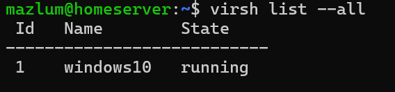
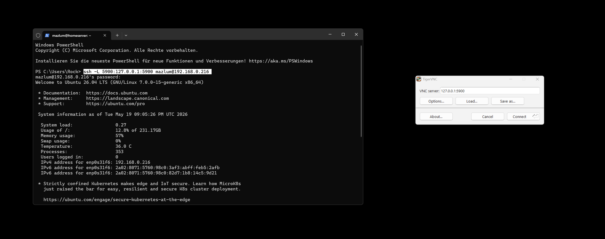
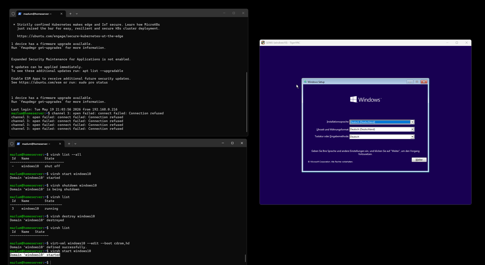
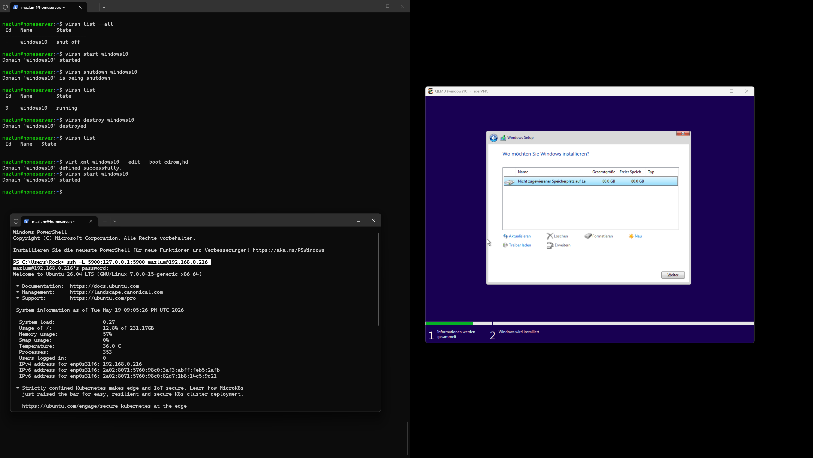
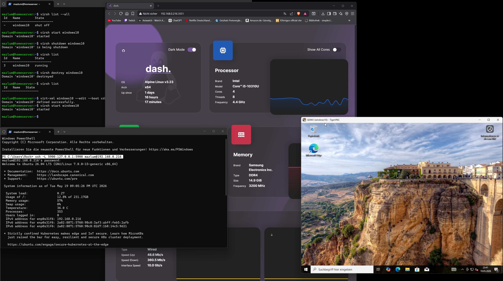

# Phase 3 - Windows Virtual Machine Deployment

## Objective

Create and boot the first Windows virtual machine using KVM, QEMU and libvirt.

---

# VM Disk Creation

## Navigate To VM Disk Directory

```bash
cd ~/vm-storage/disks
```

Purpose:
Move into the directory used for virtual machine disks.

---

## Create Virtual Disk

```bash
qemu-img create -f qcow2 windows10.qcow2 80G
```

Purpose:
Create a virtual 80 GB disk for the Windows VM.

---

# qemu-img Breakdown

| Part | Meaning |
|---|---|
| `qemu-img` | virtual disk management tool |
| `create` | create new virtual disk |
| `-f qcow2` | use qcow2 disk format |
| `windows10.qcow2` | virtual disk filename |
| `80G` | virtual disk size |

---

# What Is qcow2?

`qcow2` is the virtual disk format used by QEMU/KVM.

Advantages:
- Dynamic disk growth
- Snapshot support
- Storage efficient
- Common KVM/Proxmox format

Important:
The disk does NOT immediately use 80 GB of real storage.

Example:

| State | Real Disk Usage |
|---|---|
| Empty VM | ~194 KB |
| Windows Installed | ~20 GB |
| More Data Installed | grows dynamically |

The VM sees:
```text
80 GB
```

Linux only stores:
```text
actual used data
```

---

# Verify Virtual Disk

```bash
ls -lh
```

Purpose:
Display detailed file sizes.

Result:
- `windows10.qcow2` created successfully

---

# VM Creation

## Create Windows Virtual Machine

```bash
virt-install \
--name windows10 \
--memory 6144 \
--vcpus 4 \
--disk /home/mazlum/vm-storage/disks/windows10.qcow2 \
--cdrom /home/mazlum/vm-storage/iso/de-de_windows_10_consumer_editions_version_22h2_updated_oct_2025_x64_dvd_38efd00d.iso \
--os-variant win10 \
--network default \
--graphics vnc
```

Purpose:
Create and start the Windows 10 virtual machine.

---

# virt-install Breakdown

| Part | Meaning |
|---|---|
| `virt-install` | create virtual machine |
| `--name windows10` | VM name |
| `--memory 6144` | 6 GB RAM |
| `--vcpus 4` | 4 virtual CPUs |
| `--disk` | virtual disk path |
| `--cdrom` | Windows installation ISO |
| `--os-variant win10` | Windows optimizations |
| `--network default` | libvirt virtual network |
| `--graphics vnc` | graphical access via VNC |

---

# VM Hardware Allocation

| Resource | Value |
|---|---|
| RAM | 6 GB |
| vCPUs | 4 |
| Disk | 80 GB qcow2 |
| Graphics | VNC |
| Network | libvirt NAT |

Reasoning:
Balanced resource allocation for:
- Windows 10
- Silkroad testing
- Homelab learning
- Host stability

---

# Network Troubleshooting

## Problem

```text
network 'default' is not active
```

Reason:
libvirt dnsmasq could not start because Docker already occupied port 53.

---

# Check Port Usage

```bash
sudo ss -tulpn | grep :53
```

Purpose:
Identify processes using DNS port 53.

Result:
Docker Pi-hole container occupied port 53.

---

# Docker Container Analysis

```bash
docker ps
```

Purpose:
Display running Docker containers.

---

# Remove Unused Pi-hole Container

```bash
docker rm -f 9b9015f656fa
```

Purpose:
Stop and remove the Pi-hole container.

Result:
Port 53 released successfully.

---

# Start libvirt Network

```bash
sudo virsh net-start default
```

Purpose:
Start the default libvirt virtual network.

Result:

```text
Network default started
```

---

# VM State Management

## Show Running VMs

```bash
virsh list
```

Purpose:
Display only running virtual machines.

---

## Show All VMs

```bash
virsh list --all
```

Purpose:
Display all virtual machines including powered off VMs.

---

# VM Power Commands

## Start VM

```bash
virsh start windows10
```

Purpose:
Start the virtual machine.

---

## Graceful Shutdown

```bash
virsh shutdown windows10
```

Purpose:
Request clean shutdown from the guest OS.

---

## Force Shutdown

```bash
virsh destroy windows10
```

Purpose:
Force power off the VM.

Equivalent:
Holding the power button on a real PC.

---

# Boot Order Troubleshooting

## Problem

```text
No bootable device
```

Reason:
The VM attempted to boot from the empty virtual disk instead of the Windows ISO.

---

# Check ISO Attachment

```bash
virsh dumpxml windows10 | grep iso
```

Purpose:
Verify that the Windows ISO is attached to the VM.

---

# Fix Boot Order

```bash
virt-xml windows10 --edit --boot cdrom,hd
```

Purpose:
Boot from the Windows ISO first, then from the virtual disk.

---

# virt-xml Breakdown

| Part | Meaning |
|---|---|
| `virt-xml` | edit VM configuration |
| `windows10` | VM name |
| `--edit` | modify configuration |
| `--boot cdrom,hd` | boot ISO first |

---

# Remote Graphical Access

## Show VNC Display

```bash
virsh vncdisplay windows10
```

Result Example:

```text
127.0.0.1:0
```

Meaning:
The VM graphical display is only locally accessible on the server.

---

# SSH Port Forwarding

## Create VNC Tunnel

```bash
ssh -L 5900:127.0.0.1:5900 mazlum@192.168.0.216
```

Purpose:
Forward the VM graphical display securely to the local PC.

---

# SSH Tunnel Explanation

Without SSH tunnel:

```text
PC ❌ cannot access VM display
```

With SSH tunnel:

```text
PC → SSH → Ubuntu Server → Windows VM display
```

The SSH tunnel securely forwards:
- local PC port 5900
- to the server VNC port 5900

---

# VNC Viewer

Software Used:
- TigerVNC Viewer

Connection:

```text
127.0.0.1:5900
```

Purpose:
Display and control the Windows VM installation remotely.

---

# Windows Installation

Selected:
- Windows 10 Pro
- Offline account setup



Reason:
Better suited for:
- virtualization labs
- infrastructure testing
- self-hosted environments

---

# Learnings

- KVM/QEMU virtualization
- qcow2 virtual disks
- VM resource allocation
- libvirt networking
- Docker port conflicts
- DNS port troubleshooting
- VM boot order management
- VNC remote graphical access
- SSH port forwarding
- VM lifecycle management
- Linux infrastructure troubleshooting

---

# Current Infrastructure Status


```text
Ubuntu Homelab Server
├── KVM/QEMU
├── libvirt
├── Docker/CasaOS
├── Windows 10 VM
├── VNC Remote Access
└── SSH Management
```

---

# Next Phase

Phase 4:
- Complete Windows setup
- Install VM drivers/tools
- Configure networking
- Prepare Silkroad server environment
- Shared folders and remote access
