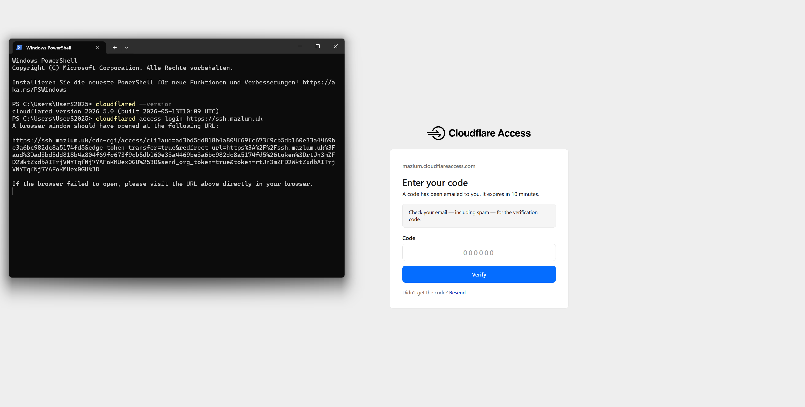
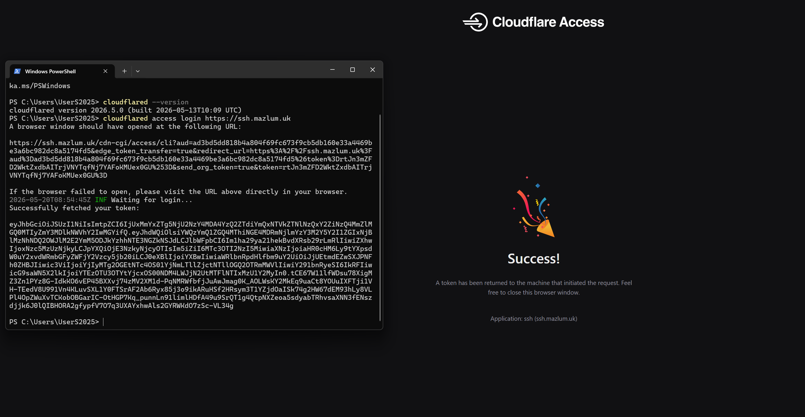
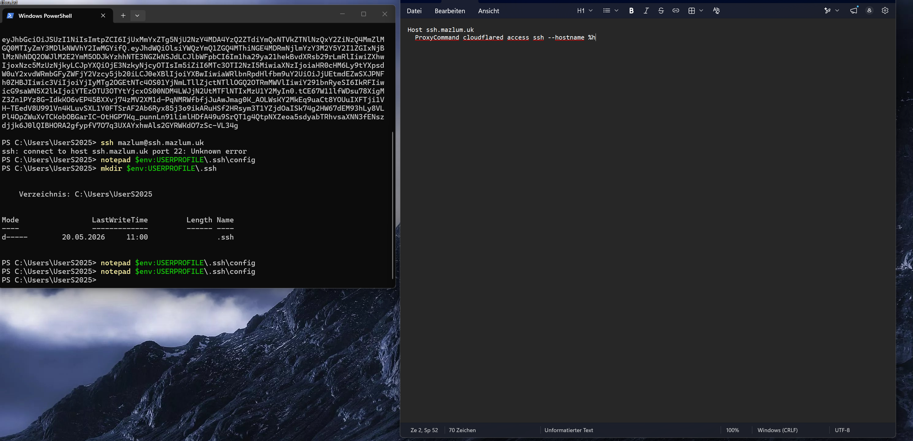
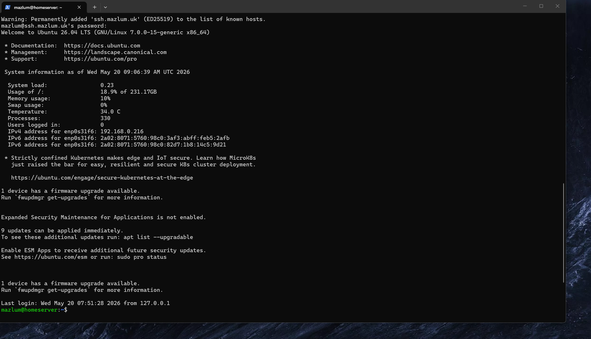

# Phase 4 - Cloudflare Native SSH Access

## Objective

Enable native SSH access over Cloudflare Tunnel while keeping browser-based SSH access available.

This allows:
- native SSH
- SCP
- SSH tunneling
- VNC forwarding
- remote infrastructure management

from outside the home network.

---

# Existing Infrastructure

Current setup already included:

```text
ssh.mazlum.uk → ssh://localhost:22
```

inside the Cloudflare Tunnel routes.

---

# Important Architecture Difference

| Component | Purpose |
|---|---|
| Tunnel Routes | network routing |
| Applications | access control / browser SSH |

---

# Install cloudflared

```powershell
winget install --id Cloudflare.cloudflared
```

---

# Verify Installation

```powershell
cloudflared --version
```

---

# Cloudflare Access Login

```powershell
cloudflared access login https://ssh.mazlum.uk
```

---

## Login Request



---

## Successful Authentication



---

# Create SSH Config Directory

```powershell
mkdir $env:USERPROFILE\.ssh
```

---

# SSH Config File

Path:

```text
C:\Users\UserS2025\.ssh\config
```

Content:

```text
Host ssh.mazlum.uk
  ProxyCommand cloudflared access ssh --hostname %h
```

---

## SSH Config Setup



---

# Native SSH Test

```powershell
ssh mazlum@ssh.mazlum.uk
```

---

## Successful Native SSH Connection



---

# Advantages

- No open router ports required
- Secure remote access
- Cloudflare authentication
- SSH tunneling support
- Works outside home network

---

# Future Use Cases

```bash
ssh mazlum@ssh.mazlum.uk
```

```bash
scp file.txt mazlum@ssh.mazlum.uk:/home/mazlum
```

```bash
ssh -L 5900:127.0.0.1:5900 mazlum@ssh.mazlum.uk
```

---

# Current Infrastructure Status

```text
Ubuntu Homelab Server
├── KVM/QEMU
├── libvirt
├── Windows VM
├── Docker/CasaOS
├── Cloudflare Tunnel
├── Browser SSH
└── Native SSH Access
```

---

# Next Phase

Phase 5:
- Remote VNC over Cloudflare SSH
- Continue Windows VM setup
- Install VM tools/drivers
- Prepare Silkroad server environment
