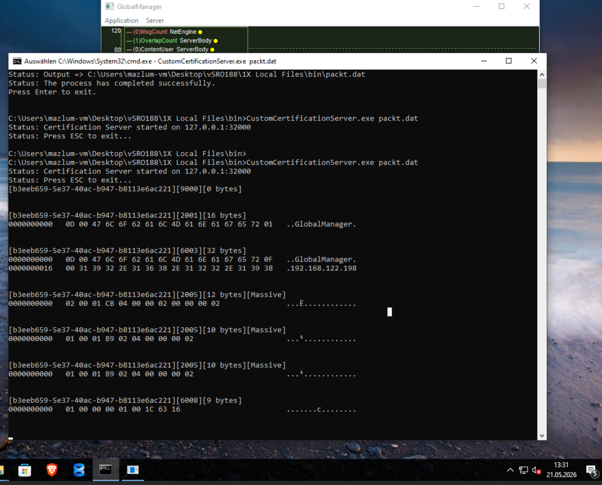

# Phase 9 — Internal vSRO Architecture & Server Communication

## Overview

Phase 9 focuses on understanding the internal architecture of the vSRO188 server environment.

Unlike previous phases which focused mainly on recovery and configuration fixes, this phase documents:

- how vSRO services communicate
- what each server process does
- how certification works
- how packets are exchanged
- the role of TCP communication
- how services register themselves
- the difference between database data and live network data
- why localhost rewrites are important
- why startup order matters
- how the MMO infrastructure is internally organized

This phase is intended as a learning/reference chapter and should be readable later like a technical book.

---

# 1. Understanding vSRO as a Distributed System

One of the biggest misconceptions about Silkroad private servers is the idea that the server consists of a single executable.

In reality, vSRO is a distributed multi-process architecture.

Each executable is an individual network service with a dedicated responsibility.

The system behaves more like a modern service infrastructure than a simple game executable.

---

# 2. Main vSRO Componen


## CertificationServer

Executable:

```text
CustomCertificationServer.exe
```

Purpose:

- authenticates internal server processes
- accepts server registrations
- initializes trust between services
- manages early handshake communication

The Certification Server acts as the first central authority in the network.

No major service can fully initialize without successful certification.

---

## GlobalManager

Executable:

```text
GlobalManager.exe
```

Purpose:

- central service coordinator
- keeps track of active services
- manages internal routing information
- distributes server state
- acts as internal service registry

The GlobalManager is NOT the game world.

It mainly manages:

```text
live service state
```

rather than permanent game data.

---

## GatewayServer

Executable:

```text
GatewayServer.exe
```

Purpose:

- first contact point for the Silkroad client
- handles login initialization
- verifies client version
- provides shard/server list
- redirects players toward gameplay servers

The GatewayServer is NOT the gameplay server.

It is the entry gateway.

---

## FarmManager

Purpose:

- manages shard/channel organization
- controls routing between services
- distributes channel information
- manages service allocation

---

## AgentServer

Purpose:

- actual gameplay communication
- movement
- combat
- inventory
- NPC interaction
- skill usage
- world interaction
- chat handling

The AgentServer is effectively the real game server.

---

## SR_ShardManager

Purpose:

- handles world-related database interaction
- character data
- world state
- spawn information
- item data
- guild data
- region data

This service is much closer to the SQL backend than the GlobalManager.

---

# 3. Understanding vSRO as a Real Network Infrastructure

vSRO should not be viewed as:

```text
just a private server
```

It should be understood as:

```text
a distributed MMO infrastructure
```

with:

- TCP communication
- internal routing
- centralized certification
- service registration
- live service discovery
- binary packet protocols
- real-time process coordination
- database-backed world persistence

---

# 4. The Three Layers of vSRO

Understanding vSRO requires separating three completely different types of information.

---

## 4.1 Configuration Data

Examples:

```text
server.cfg
srNodeData
packt.dat
```

These files define:

- IP addresses
- ports
- service structure
- node relationships
- certification targets
- server organization

Configuration data tells services:

```text
where to connect
how to initialize
which ports to use
which nodes exist
```

---

## 4.2 Database Data

The SQL database stores persistent world information.

Examples:

```text
Accounts
Characters
Items
Guilds
NPCs
Skills
Regions
Spawn Data
Shard Information
```

The database represents:

```text
long-term persistent state
```

---

## 4.3 Live Network Data

This is what appears inside server console windows.

Examples:

```text
[2001]
[6003]
[2005]
GlobalManager
192.168.122.198
```

These are NOT database entries.

These are live network packets exchanged between server processes.

Examples include:

- certification requests
- handshake packets
- service registration
- routing communication
- live process coordination

---

# 5. TCP Communication

vSRO services communicate primarily through:

```text
TCP sockets
```

NOT through:

- HTTP
- REST APIs
- WebSockets

The architecture is based on proprietary binary TCP communication.

---

# 6. What is a Socket?

A socket is essentially:

```text
a network communication endpoint
```

Example:

```text
GlobalManager ↔ CertificationServer
```

This communication exists through TCP socket connections.

---

# 7. Understanding Socket Binding

When a server starts, it must decide:

```text
which IP and port to listen on
```

This process is called:

```text
socket binding
```

Example:

```text
127.0.0.1:32000
```

Internally this roughly becomes:

```cpp
bind()
listen()
```

The process then waits for incoming TCP connections.

---

# 8. Understanding Client vs Server Roles

A single executable can act as BOTH:

- a client
- a server

depending on the connection direction.

Example:

| Connection | Role |
|---|---|
| GlobalManager → CertServer | GlobalManager acts as client |
| GatewayServer → GlobalManager | GlobalManager acts as server |

This is a critical networking concept.

---

# 9. Understanding the Certification Process

The CertificationServer acts similarly to:

```text
a security checkpoint
```

Every service must identify itself before entering the internal server network.

Typical startup flow:

```text
Service starts
    ↓
Connects to CertificationServer
    ↓
Sends identification data
    ↓
Certification validation
    ↓
Service registration
    ↓
Normal operation begins
```

Without successful certification:

- services crash
- DMP files may appear
- initialization fails
- internal communication cannot start

---

# 10. What Happens During Startup

When:

```cmd
GlobalManager.exe
```

starts, the process roughly performs the following steps:

1. Read configuration files
2. Initialize networking
3. Open TCP sockets
4. Connect to CertificationServer
5. Send identification packet
6. Request certification
7. Register itself in the internal network

Only AFTER this sequence does the service become operational.

---

# 11. Understanding Packet Communication

vSRO uses a proprietary packet-based protocol.

Communication roughly follows:

```text
TCP
  ↓
Packet Header
  ↓
Opcode
  ↓
Payload
```

---

# 12. What is an Opcode?

An opcode represents:

```text
a message type
```

Examples seen during certification:

| Opcode | Approximate Meaning |
|---|---|
| 2001 | Service identification |
| 6003 | Network information |
| 2005 | Certification / handshake |
| 6008 | Response / status |

These meanings are reconstructed through reverse engineering and observation.

Joymax never officially documented the protocol.

---

# 13. Understanding Payload Data

The payload contains the actual packet contents.

Examples:

```text
GlobalManager
192.168.122.198
```

This data is transferred inside binary network packets.

---

# 14. Understanding Hexadecimal Data

Packet data is transferred as raw bytes.

Examples:

```text
47 6C 6F 62 61 6C
```

This hexadecimal sequence translates into ASCII text:

```text
Global
```

The console displays portions of binary packet data for debugging purposes.

---

# 15. Understanding the Displayed IP Address

During certification logs, the server displayed:

```text
192.168.122.198
```

This IP was NOT manually entered inside the visible configuration.

Instead, the server most likely retrieved it dynamically from Windows networking APIs.

Possible internal APIs include:

```cpp
gethostname()
gethostbyname()
GetAdaptersInfo()
```

The server likely selects:

- the first active IPv4 adapter
- the first non-loopback interface
- or the preferred local adapter

This explains why VMware, Hamachi, or VirtualBox adapters often cause problems in old Silkroad setups.

---

# 16. Difference Between Connect-To IP and Advertised IP

This is an extremely important networking concept.

These are NOT the same thing.

---

## Connect-To IP

Example:

```cfg
Certification "127.0.0.1", 32000
```

This means:

```text
Connect TO the CertificationServer here
```

---

## Advertised IP

Example seen in packet logs:

```text
192.168.122.198
```

This means:

```text
Other services can reach me using this address
```

The service announces its own network identity.

---

# 17. Understanding Localhost Rewrites

Many leaked vSRO configurations contain:

- outdated WAN IPs
- old LAN addresses
- broken VM addresses
- incorrect ports

Example broken configuration:

```cfg
Certification "25.x.x.x", 24173
```

Fixed localhost configuration:

```cfg
Certification "127.0.0.1", 32000
```

This forces all services to communicate locally on the same machine.

---

# 18. Understanding packt.dat

One of the most confusing aspects of vSRO is:

```text
packt.dat
```

The server does NOT directly read many `.ini` files during runtime.

Instead:

```text
INI Files
    ↓
Convert.exe
    ↓
packt.dat
```

The generated `packt.dat` becomes the actual runtime data source.

---

# 19. Why packt.dat Exists

Possible reasons include:

- faster loading
- internal binary structure
- simplified deployment
- reduced runtime parsing
- protection against direct editing

This means:

```text
editing INI files alone is often NOT enough
```

A rebuild is required:

```cmd
Convert.exe ini ini dat packt.dat
```

---

# 20. Understanding Service Registration

One of the most important concepts inside vSRO is:

```text
service registration
```

Services do not simply start and operate independently.

Every important process must announce itself to the internal infrastructure.

---

# Example Registration Flow

```text
GlobalManager starts
    ↓
Connects to CertificationServer
    ↓
Sends identity information
    ↓
Announces IP and port
    ↓
Receives certification
    ↓
Registers as active service
```

Only after registration can other services discover and communicate with it.

---

# 21. Understanding Service Discovery

Services must know:

```text
where other services exist
```

The GlobalManager effectively behaves like:

```text
an internal service registry
```

Services can ask:

```text
Where is AgentServer?
Which GatewayServer is active?
Which FarmManager exists?
```

The GlobalManager keeps track of this information dynamically.

---

# 22. Comparison to Modern Infrastructure

vSRO internally behaves similarly to modern distributed systems.

| Modern Infrastructure | vSRO Equivalent |
|---|---|
| Service Registry | GlobalManager |
| Authentication Layer | CertificationServer |
| Reverse Proxy Entry | GatewayServer |
| World/Game Logic | AgentServer |
| Persistent Backend | SQL + ShardManager |

Even though Silkroad is old, the architecture is surprisingly advanced.

---

# 23. Understanding Live State vs Persistent State

This is one of the most important architecture concepts.

---

## Persistent State

Stored in SQL.

Examples:

```text
Characters
Guilds
Items
Skills
Accounts
```

These survive restarts.

---

## Live State

Stored inside running services.

Examples:

```text
Connected players
Current network sessions
Active channels
Running services
Online status
Temporary combat state
```

This exists only while services are running.

---

# 24. Why the GlobalManager is NOT the Database

Many beginners assume:

```text
GlobalManager = central storage
```

This is incorrect.

The GlobalManager mainly manages:

```text
runtime coordination
```

while SQL stores:

```text
persistent world data
```

---

# 25. Why Startup Order Matters

Services depend on previously initialized components.

Example startup chain:

```text
CertificationServer
    ↓
GlobalManager
    ↓
MachineManager
    ↓
GatewayServer
    ↓
FarmManager
    ↓
AgentServer
```

If a required upstream service is unavailable:

- connection attempts fail
- certification fails
- services terminate
- retry loops begin

---

# 26. Understanding GatewayServer

The GatewayServer is the first contact point for the Silkroad client.

Responsibilities:

- login initialization
- client version checks
- server list delivery
- shard selection
- forwarding toward gameplay services

The GatewayServer is NOT the gameplay server.

It acts as the entry gateway.

---

# 27. Understanding AgentServer

The AgentServer handles:

- movement
- combat
- inventory
- NPC interaction
- world interaction
- skills
- chat
- gameplay synchronization

This is the actual gameplay communication service.

---

# 28. Understanding Shards

A shard is essentially:

```text
an independent world instance
```

Different shards can have:

- separate economies
- separate characters
- separate populations
- independent world states

---

# 29. Typical Client Connection Flow

The Silkroad client later follows roughly this sequence:

```text
Client
  ↓
GatewayServer
  ↓
Login Process
  ↓
Server List
  ↓
Shard Selection
  ↓
AgentServer
  ↓
Gameplay
```

The client does NOT connect directly to the gameplay server initially.

---

# 30. Why vSRO Uses Multiple Processes

Using many specialized services provides advantages:

- modularity
- restart flexibility
- better organization
- scalability
- separation of responsibilities

Example:

If DownloadServer crashes:

```text
patching may fail
```

but:

```text
gameplay can continue
```

This architecture is much more advanced than many older monolithic game servers.

---

# 31. Understanding MachineManager

MachineManager manages:

- local machine registration
- process coordination
- node information
- local infrastructure state

During earlier failures it displayed:

```text
request server certification
```

because it was waiting for successful internal registration.

---

# 32. Why Packet Analysis Matters

Almost the entire MMO infrastructure depends on packet communication.

Examples:

```text
Client ↔ Gateway
Gateway ↔ GlobalManager
Farm ↔ Agent
Agent ↔ Shard
```

Understanding packets is essential for:

- reverse engineering
- emulator development
- debugging
- protocol analysis
- anti-cheat understanding
- custom tooling

---

# 33. Understanding Handshakes

A handshake represents:

```text
initial trust establishment
```

Example:

```text
Hello
I am GlobalManager
My IP is X
My Port is Y
Please certify me
```

This happens BEFORE normal communication begins.

---

# 34. Why DMP Files Appear

Old C++ servers often crash hard when initialization fails.

Examples:

- invalid certification
- bad pointers
- failed socket creation
- incorrect node configuration
- broken startup state

Result:

```text
Unhandled Exception
```

which creates:

```text
.dmp files
```

In Phase 8, the empty ReportLog strongly suggested:

```text
the crash happened BEFORE normal logging initialization
```

This pointed toward early certification failure rather than database issues.

---

# 35. Final Understanding of Phase 9

At this point, the vSRO188 environment should no longer be viewed as:

```text
just a private server
```

Instead, it should be understood as:

```text
a distributed MMO infrastructure
```

consisting of:

- TCP communication
- service registration
- centralized certification
- binary packet protocols
- network routing
- process coordination
- database-backed world state
- real-time multiplayer communication

This understanding forms the foundation for:

- deeper debugging
- packet reverse engineering
- protocol analysis
- custom development
- advanced server architecture work
- emulator research
- future tooling development
